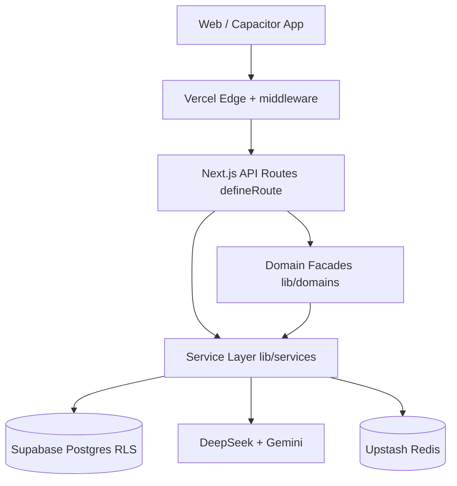

# Kaify Architecture

Last updated: 2026-07-05 · Score target track: **65 → 72 → 80 → 88 → 92+**

## System context

| Layer | Location | Responsibility |
|-------|----------|----------------|
| **Presentation** | `app/**`, `components/**` | UI, client state, i18n |
| **API** | `app/api/**` | Auth, rate limits, validation, envelope |
| **Application** | `lib/services/**` | Use cases, orchestration |
| **Domain facades** | `lib/domains/**` | Bounded context entry points (migration target) |
| **Infrastructure** | `lib/supabase`, `lib/cache`, `lib/ai` | External systems |

**Request flow:** `middleware.ts` → `defineRoute` → service → Supabase RPC/table.

---

## Score roadmap

| Phase | Target | Status | Deliverables |
|-------|--------|--------|--------------|
| **Faz 1** | 72 | ✅ Done | defineRoute standard, `.env.example`, market=DB, [layers.md](./layers.md) |
| **Faz 2** | 80 | ✅ Done | `lib/domains/*`, domain events, [bounded-contexts.md](./bounded-contexts.md) |
| **Faz 3** | 88 | ✅ Done | Read/write repos, outbox DB + cron, integration flow tests |
| **Faz 4** | 92+ | ✅ Done | `/api/v1` (28 routes), CODEOWNERS, onboarding doc, deprecation headers |

Full gate checklist: [verification-2026-07.md](./verification-2026-07.md)

---

## Key decisions (ADR index)

| ADR | Topic |
|-----|--------|
| [001](./adr/001-nextjs-supabase-stack.md) | Next.js + Supabase stack |
| [002](./adr/002-define-route-envelope.md) | defineRoute API envelope |
| [003](./adr/003-rls-rpc-mutations.md) | RLS + service-role RPC mutations |
| [004](./adr/004-market-db-catalog.md) | Market catalog single source |
| [005](./adr/005-cache-read-models.md) | Redis read-through cache |
| [006](./adr/006-api-v1-reexports.md) | API v1 re-export versioning |

---

## Related docs

- [RUNBOOK.md](../RUNBOOK.md) — operations
- [SECURITY.md](../SECURITY.md) — threat model
- [api-inventory.md](../security/api-inventory.md) — route list
- [cache-strategy.md](./cache-strategy.md)
- [event-outbox.md](./event-outbox.md)
- [developer-onboarding.md](./developer-onboarding.md)
- [api-versioning.md](./api-versioning.md)
- [Scalability track](../scalability/README.md)
- [Reliability track](../reliability/README.md)
- [Sustainability track](../sustainability/README.md)
- [Enterprise scorecard](../enterprise/README.md)

Contact: support@kaifyai.org
