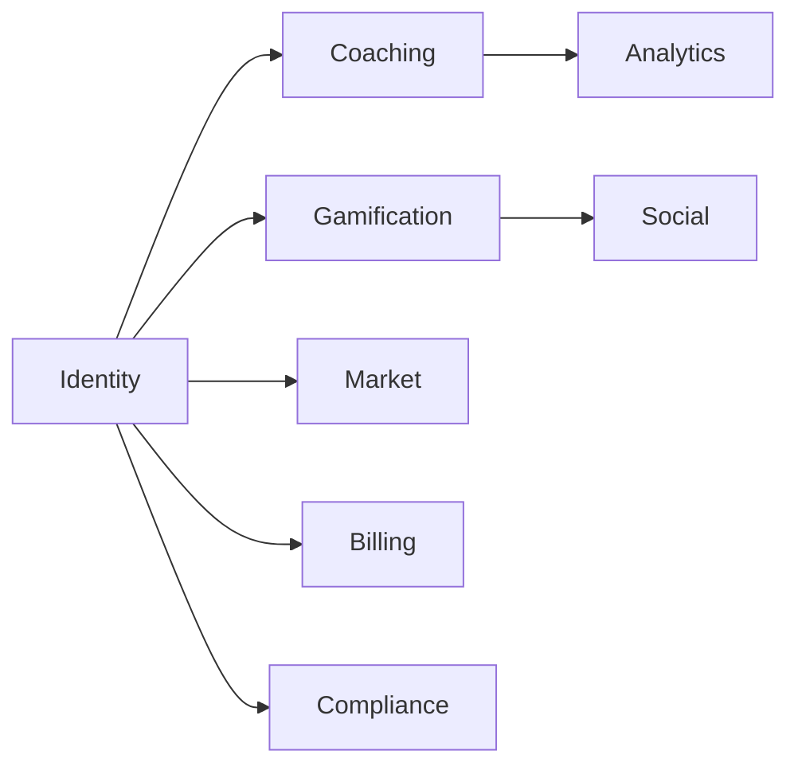

# Bounded Contexts

Last updated: 2026-07-05

| Context | Module | Tables / RPCs | Notes |
|---------|--------|---------------|-------|
| **Identity** | `lib/domains/auth` | auth.users, profiles | MFA, CSRF, sessions |
| **Coaching / AI** | `lib/domains/ai` | chat_messages, coaching_memory | DeepSeek + Gemini |
| **Gamification** | `lib/services/streak.service`, `gem.service` | user_streaks, gem_ledger | Check-in RPC |
| **Market** | `lib/domains/market` | market_items, user_market_inventory | Catalog from DB |
| **Billing** | `lib/domains/billing` | billing_events, profiles.tier | Paddle webhook |
| **Analytics** | `lib/services/analytics.service` | analytics_daily, health_steps | Cached read models |
| **Social** | `lib/services/leaderboard.service` | RPC leaderboards | Public masked IDs |
| **Compliance** | `lib/domains/compliance` | consent_*, data_export_logs | Export / delete |
| **Notifications** | `lib/services/push.service` | push_subscriptions | Web + native FCM |
| **Platform** | `lib/domains/platform` | cache, flags, events | Shared kernel |

## Context map

## Migration rule

When touching a service, add re-export to matching `lib/domains/<context>/index.ts`. Do not duplicate logic.
